[github](https://github.com/michaelflppv) &nbsp;·&nbsp;
[linkedin](https://www.linkedin.com/in/michaelflppv/)

> M.Sc. Information Systems at TU Munich, in Munich, Germany. 
> Machine learning on graphs, LLM & RAG pipelines, and the data plumbing behind them.

<samp>python &nbsp; sql &nbsp; java &nbsp; pytorch &nbsp; pytorch geometric &nbsp; hugging face &nbsp; scikit-learn &nbsp; azure &nbsp; databricks &nbsp; docker &nbsp; git</samp>

**[prompt-llm-benchmark](https://github.com/michaelflppv/prompt-llm-benchmark)** &nbsp;·&nbsp; <samp>typescript, hugging face</samp> 
Discovers compatible Hugging Face models on the fly, runs reproducible 
multi-model evaluations, and recommends the best prompt–LLM pair by 
accuracy, latency, and resource cost.

**[ged-approximation](https://github.com/michaelflppv/ged-approximation)** &nbsp;·&nbsp; <samp>c++, jupyter</samp> 
Bachelor thesis on approximation algorithms for Graph Edit Distance: 
implementations, benchmarks, and evaluation against exact computation.

**[cam-vision](https://github.com/michaelflppv/cam-vision)** &nbsp;·&nbsp; <samp>python, fastapi, flutter</samp> 
Self-hosted computer-vision pipeline for live camera feeds — face 
recognition and license-plate reading, streamed through a FastAPI 
server to a desktop dashboard.

**[flight-delay-insurance](https://github.com/michaelflppv/flight-delay-insurance)** &nbsp;·&nbsp; <samp>python, solidity</samp> 
Parametric flight-delay insurance on-chain: smart contracts that pay out 
automatically from flight data. Built at UZH's Deep Dive into Blockchain.

